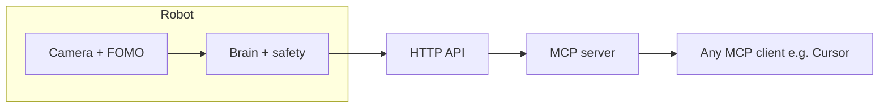

# TrashBot

[](https://github.com/SatyamChouksey-88/trashbot/actions/workflows/ci.yml)
[](LICENSE)


A small wheeled bin that finds lightweight trash on the floor, scoops it in, and tips it into its own compartment — using on-device vision and safety-first firmware.

## Demo


The clip is from the **digital-twin simulator** (no physical robot). It shows detect → approach → scoop → recover from faults.

## Features

- Finds and scoops **small, light** floor trash into its onboard bin (not a room vacuum).
- On-device vision: **Edge Impulse FOMO** on **Seeed XIAO ESP32S3 Sense** (QVGA → 96×96); `FakeDetector` for dev without a model.
- **Safety-first firmware**: every motor command passes `safety_logic`; e-stop, obstacle stop, duty caps, manual command expiry, watchdogs, stuck recovery.
- **Phone web UI** on the robot’s Wi‑Fi — no internet or CDN required.
- **Bolo** commands in Hinglish, English, and Devanagari (type or Gboard voice).
- Optional **AI agent** via MCP (`run_command`, status, photos) from Cursor or any MCP client.
- **Simulator + CI** for regression before hardware tests.

## How it works



- **Camera + FOMO** — center-cropped frames, object detections with scores and positions.
- **Brain + safety** — state machine for search, approach, scoop; `safety_logic` filters all motion.
- **HTTP API** — same JSON the web UI and Bolo use (`/api/drive`, `/api/clean`, `/api/stop`, …).
- **MCP server** — TypeScript agent tools that call the API (modes: read-only, dry-run, full).
- **MCP client** — optional; sends natural language that becomes API calls (never bypasses firmware safety).

## Project status

| Gate | Software (CI) | Hardware |
|------|-----------------|----------|
| G1 Drive | Done | **Not field-tested** |
| G2 Vision | Done | **Not field-tested** |
| G3 Chase | Done | **Not field-tested** |
| G4 Scoop | Done | **Not field-tested** |
| G5 Full auto | Done | **Not field-tested** |
| G6 Extras | Done | **Not field-tested** |
| G7 Agent | Done | **Not field-tested** |
| G11 Bolo | Done | **Not field-tested** |

**Honest note:** this repository is built and tested in software (firmware build, unit tests, simulator, Playwright on a mock). No complete end-to-end run on a physical robot is claimed here.

## Hardware

Approximate BOM (INR; prices vary — verify before buying):

| Part | ~INR |
|------|------|
| XIAO ESP32S3 Sense | 1,585 |
| 4WD chassis + TT motors | 500–650 |
| TB6612FNG driver | 160–200 |
| MG996R servo (180°) | 210 |
| HC-SR04 + 1k/2k resistors | 100 |
| 2× 18650, holder, BMS/charger | 500–800 |
| 2× buck (5 V logic, 6 V servo) | 200–400 |
| Wire, switch, caps, bin | 200–300 |

**Pin map (XIAO D → GPIO → function)** — see `firmware/include/config.h` and [Wiring](docs/getting-started/WIRING.md):

| D | GPIO | Function |
|---|------|----------|
| D0 | 1 | Motor A PWM |
| D1 | 2 | Motor A IN1 |
| D2 | 4 | Motor A IN2 |
| D3 | 3 | Battery ADC (optional) |
| D4 | 5 | Motor B PWM |
| D5 | 6 | Motor B IN1 |
| D6 | 43 | Bumper input (optional) |
| D7 | 44 | Ultrasonic ECHO |
| D8 | 8 | Servo |
| D9 | 9 | Ultrasonic TRIG |
| D10 | 21 | Status LED |

**Power:** use protected 18650 cells, correct polarity, a proper BMS/charger, and **never charge unattended**. Servo runs from a **separate 6 V** supply (not the XIAO 5 V pin).

## Quick start (software only)

**Windows (PowerShell)** and **Linux/macOS** — from repo root:

```bash
python -m pip install platformio
python -m platformio run -d firmware -e xiao
```

```bash
python -m pip install -r tools/requirements.txt -r tools/requirements-dev.txt
python -m pytest tools/tests -q
```

```bash
cd agent && npm ci && npm run build && npm test
```

```bash
cd shared/lang && npm ci && npm test
```

Simulator (needs native build — usually **CI only**; on restricted machines set `TRASHBOT_NO_NATIVE=1`):

```bash
python tools/sim/build_sim_brain.py
python tools/sim/run.py --scenario bright_light --gif docs/media/sim_demo.gif
```

Bolo UI without hardware:

```bash
cd shared/lang && npm run dev
```

Open http://localhost:8790

## Quick start (hardware)

1. Assemble chassis and set buck voltages **before** wiring the XIAO — [USER_STEPS](docs/getting-started/USER_STEPS.md).
2. Wire per [WIRING.md](docs/getting-started/WIRING.md) (common GND, echo divider, 6 V servo).
3. Copy `firmware/include/secrets.example.h` → `secrets.h` (never commit); flash firmware.
4. Join robot Wi‑Fi `TrashBot-XXXX` / default AP password in docs; open http://192.168.4.1.
5. Complete **Bring-up** tab; calibrate servo and scoop zone.
6. First supervised clean (wheels up, then floor) — [TESTING.md](docs/reference/TESTING.md).

## Bolo commands

Examples: `kachra saaf karo`, `20 cm aage chalo`, `ruko`, `photo lo`, `battery kitni hai`, `clean the room`.

**Safety:** stop words always win — any phrase containing `ruko` / `stop` / `रुको` sends stop first.

Full list: [docs/reference/COMMANDS.md](docs/reference/COMMANDS.md).

## AI agent (optional)

The `agent/` package is an MCP server over the robot HTTP API.

| Mode | Behavior |
|------|----------|
| `read_only` | Status, photos, health — no motion |
| `dry_run` | Describes motion but does not POST drive/move/turn (default) |
| `full` | Executes motion (use only when the robot is safe to move) |

Cursor: `.cursor/mcp.json` runs `node agent/dist/index.js` with `TRASHBOT_URL` and `TRASHBOT_MODE`. Any MCP-compatible desktop app can use the same entrypoint or the `.mcpb` bundle from `npm run pack` in `agent/`.

Details: [docs/reference/AGENT.md](docs/reference/AGENT.md).

## Repository structure

| Path | Role |
|------|------|
| `firmware/` | ESP32 Arduino/PlatformIO firmware |
| `agent/` | MCP server + mock robot |
| `shared/lang/` | Bolo parser and executor (pre-tested) |
| `e2e/` | Playwright tests (mock robot) |
| `tools/` | Simulator, dataset scripts, `release_check.py` |
| `dataset/` | Dataset readme only (binaries gitignored) |
| `docs/` | [Documentation index](docs/README.md) |
| `.github/` | CI workflows |
| `.cursor/` | Slash commands and operator rule |

## Development

```bash
python -m platformio run -d firmware -e xiao
python -m pytest tools/tests -q
cd agent && npm test
cd shared/lang && npm test && npm run test:fuzz && npm run docs:check
python tools/embed_lang.py --check
```

**CI jobs:** `shared-lang`, `firmware-build`, `firmware-test` (Unity), `tools` (core + sim + pytest), `agent`, `agent-verify` (MCPB smoke), `e2e`.

Contributing: branch from `main`, keep tests green, follow [AGENTS.md](AGENTS.md). Push after local checks pass; never commit secrets.

## Safety and limitations

- Not a toy for unsupervised use around children or pets.
- Scoop is for **small, light** items; heavy or sharp objects can jam the mechanism.
- Vision needs reasonable indoor lighting; model must be trained for your floor/clutter.
- **Real stop:** phone **■ RUKO · STOP**, e-stop, or **power switch** — chat is not an emergency stop.

## Credits and licence

MIT — see [LICENSE](LICENSE). Third-party licences: [THIRD_PARTY_NOTICES.md](THIRD_PARTY_NOTICES.md). Dataset credit: TACO and projects listed in [docs/project/REFERENCES.md](docs/project/REFERENCES.md).
