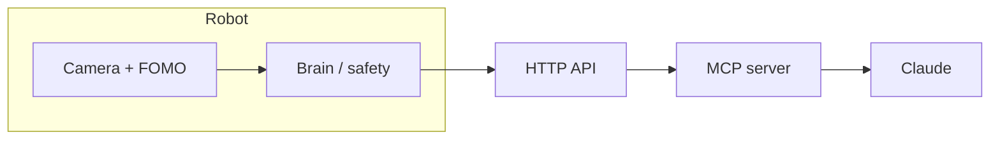

# TrashBot

Small ESP32-S3 robot dustbin with on-device vision and an optional Claude MCP agent on your laptop.



## Quick start (software)

```bash
python -m pip install platformio
python -m platformio run -d firmware -e xiao
cd agent && npm ci && npm run build && npm test
python -m pip install -r tools/requirements.txt -r tools/requirements-dev.txt
python -m pytest tools/tests -q
python tools/sim/build_sim_brain.py
python tools/sim/run.py --scenario bright_light --gif docs/media/sim_demo.gif
```


## Bill of materials (approx.)

| Part | Price (INR) |
|------|-------------|
| XIAO ESP32S3 Sense | ~1,585 |
| TB6612FNG | ~157–194 |
| 4WD chassis + motors | ~499–649 |
| MG996R 180° servo | ~212 |
| HC-SR04 + resistors | ~99 |
| 2× 18650 + holder + charger | ~500–800 |
| 2× buck converters | ~200–400 |
| Bin, wire, switch, caps | ~200–300 |

## Gates

| Gate | Software | Hardware |
|------|----------|----------|
| G1 Drive | done | pending user test |
| G2 Vision | done | pending user test |
| G3–G5 Autonomy | done | pending user test |
| G6 Extras | done | pending user test |
| G7 Agent | done | pending user test |

## Bolo — Hinglish + English commands

On the robot web page, use the **Bolo** box at the top (type or use the phone keyboard mic). In Cursor, use `/trashbot` and natural commands, or MCP tool `run_command`.

Examples: `kachra saaf karo`, `20 cm aage chalo`, `photo lo`, `battery kitni hai`, `ruko`.

- Full cheat sheet: [docs/COMMANDS.md](docs/COMMANDS.md)
- Try without hardware: `cd shared/lang && npm run dev` → http://localhost:8790
- Future upgrades backlog: [docs/UPGRADES.md](docs/UPGRADES.md)

## GitHub and pushing

`origin` points at [github.com/SatyamChouksey-88/trashbot](https://github.com/SatyamChouksey-88/trashbot) for CI. Nothing pushes by itself. After `pio run`, `pytest`, and `npm test` pass locally, push from a machine where your IT policy allows:

```bash
git push origin main
```

See [docs/DECISIONS.md](docs/DECISIONS.md) for the remote note. Audit status: [docs/AUDIT_REPORT.md](docs/AUDIT_REPORT.md).

## Docs

- [docs/MASTER_PROMPT.md](docs/MASTER_PROMPT.md) — full spec  
- [docs/USER_STEPS.md](docs/USER_STEPS.md) — assembly → Gate 7  
- [docs/API.md](docs/API.md) · [docs/WIRING.md](docs/WIRING.md) · [docs/TESTING.md](docs/TESTING.md)  
- [docs/DATASET.md](docs/DATASET.md) · [docs/AGENT.md](docs/AGENT.md) · [docs/PLAN.md](docs/PLAN.md)
