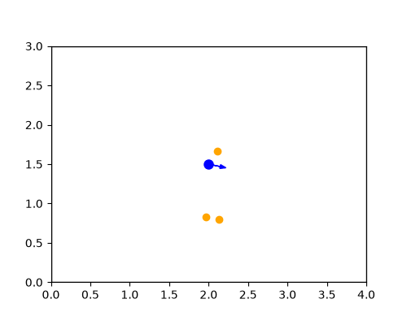
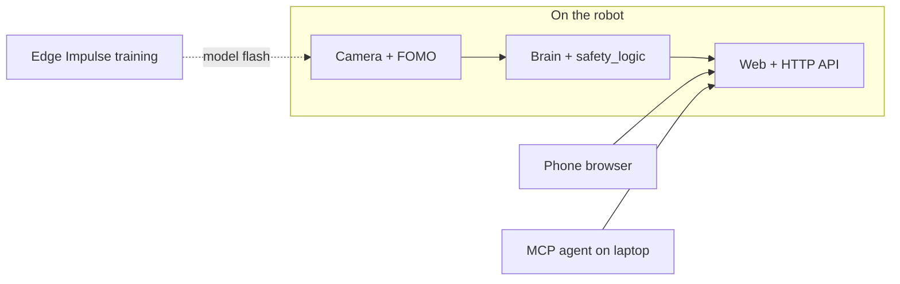

# TrashBot

[](https://github.com/SatyamChouksey-88/trashbot/actions/workflows/ci.yml)
[](LICENSE)


**Physical AI robot dustbin** — a small four-wheel robot with a bin on top and a front scoop. It watches the floor with an on-board camera, finds light trash (paper, wrappers, chips packets), drives to it, scoops, tips into the bin, and repeats. **Safety logic lives on the robot**; a bad command or a disconnected laptop cannot bypass motor limits.

**Full project guide (Word, v1.0):** [TrashBot_Project_Guide.docx](TrashBot_Project_Guide.docx) — wiring figures, phone UI, Bolo cheat sheet, gates checklist, and “who does what”. This README is the GitHub entry point; the guide is the deep dive.

## Demo



Digital-twin simulator (no physical robot): detect → approach → scoop → fault recovery.

## What makes TrashBot different

| | |
|---|---|
| **On-device vision** | Edge Impulse FOMO on the ESP32-S3 Sense — no cloud needed to spot trash. |
| **Safety first** | Every motor command through `safety_logic`: obstacle stop, command expiry, motor lease, watchdog, stuck recovery. |
| **Bolo** | Hinglish, English, Devanagari — e.g. `kachra saaf karo`, `20 cm aage chalo`, `रुको`. |
| **Optional agent** | MCP server on your laptop (`read_only` / `dry_run` / `full`); firmware still decides motion. |
| **Test before solder** | Simulator, 16 JSON fault scenarios, unit tests, Playwright, CI on every push. |

## One cleaning run (what happens)

1. You start **Saaf karo · Clean** on the phone, via Bolo, or from the agent.
2. Pre-flight: health, bring-up done, battery OK.
3. Robot scans, locks onto trash, approaches with ultrasonic obstacle stop.
4. Scoop DOWN → creep → CARRY; vision checks if the item left the floor.
5. TIP into the bin; repeat until item or time limit — or stop / estop / fault.

## How it fits together



| Piece | Role |
|-------|------|
| Camera + FOMO | Bounding boxes on floor trash (96×96 pipeline). |
| Brain + safety | Search, approach, scoop sequence; vets every motor command. |
| HTTP API | `/api/*` — shared by phone UI, Bolo, and agent tools. |
| TB6612 + 4 motors | Differential drive. |
| MG996R servo | Scoop DOWN / CARRY / TIP. |
| HC-SR04 | Forward distance; obstacle stop. |
| `agent/` | MCP tools + modes; calls the same API as the phone. |

## Project status (Sept 2026)

Software is **built, simulated, and CI-tested**. **Hardware is not field-tested yet.** “Done” below means software only.

| Gate | Meaning | Software | Hardware |
|------|---------|----------|----------|
| G0 | Boot self-test (POST) | Done | Pending |
| G1 | Drive, STOP, estop | Done | Pending |
| G2 | Vision (your EI model) | Done* | Pending |
| G3–G5 | Search, scoop, full auto | Done (sim) | Pending |
| G6 | Battery, bumper, profiles | Done | Pending |
| G7 | MCP agent | Done (mock) | Pending |
| G11 | Bolo commands | Done | Pending |

\*Ships with `FakeDetector` until you add `TrashBot_inferencing` from Edge Impulse project **TrashBot**.

Gate checklists: [docs/reference/TESTING.md](docs/reference/TESTING.md) and the Word guide §10.

## Hardware

**~₹3,500–4,500** total (India, approximate — verify listings).

| Part | ~INR | Notes |
|------|------|--------|
| XIAO ESP32S3 Sense | 1,585 | Camera + PSRAM |
| 4WD chassis + TT motors | 500–650 | |
| TB6612FNG | 160–200 | |
| MG996R servo | 210 | 180° scoop |
| HC-SR04 + 1k/2k | 100 | Divider on ECHO |
| 2× 18650 + BMS/charger | 500–800 | **Protected cells, 2S** |
| 2× buck converters | 200–400 | 5 V logic, **6 V servo** |
| Bin, wire, switch, caps | 200–300 | **Power switch = real e-stop** |

**Wiring rules:** common GND; servo on **6 V buck only**; ECHO divided 5 V → 3.3 V; bulk cap near servo and motors. Details: [docs/getting-started/WIRING.md](docs/getting-started/WIRING.md).

**Pin map** (`firmware/include/config.h`):

| XIAO | GPIO | Function |
|------|------|----------|
| D0 | 1 | PWMA |
| D1 | 2 | AIN1 |
| D2 | 4 | AIN2 |
| D3 | 3 | Battery ADC (optional) |
| D4 | 5 | PWMB |
| D5 | 6 | BIN1 |
| D6 | 43 | Bumper (optional, off by default) |
| D7 | 44 | US ECHO |
| D8 | 8 | Servo |
| D9 | 9 | US TRIG |
| D10 | 21 | Status LED |

GPIO uniqueness is enforced by automated tests (`tools/tests/test_pin_map.py`).

## Phone UI (no internet)

Connect to Wi‑Fi `TrashBot-XXXX`, open http://192.168.4.1. All assets are on the robot.

| Area | You use it for |
|------|----------------|
| **Bolo box** (top) | Type or Gboard mic — `ruko`, `kachra saaf karo`, … |
| **■ RUKO · STOP** | Fastest software stop |
| **Drive** | D-pad, speed, estop (latched) |
| **Auto** | Saaf karo · Clean, session stats |
| **Health / Bring-up** | POST, calibration wizard |
| **Learning** | Recipe scores, phrases, reset |

## Bolo (commands)

| Intent | Hinglish examples | English examples |
|--------|-------------------|------------------|
| Stop | `ruko`, `ruk jao`, `रुको` | `stop`, `wait` |
| Clean | `kachra saaf karo` | `clean the room` |
| Move | `20 cm aage chalo` | `forward 20 cm` |
| Turn | `90 degree left ghumo` | `turn left 90` |
| Photo / status | `photo lo`, `kya haal hai` | `take a photo`, `status` |

**Safety (always on):** stop words win; `mat` / `nahi` / `don't` + motion → stop; typos ask, never move; limits (e.g. back 20 cm, forward 50 cm). **Chat is not an e-stop** — use STOP or the power switch.

Full cheat sheet: [docs/reference/COMMANDS.md](docs/reference/COMMANDS.md). Cursor: `/trashbot`, `/ruko`, `/saaf-karo`.

## AI agent (optional)

`agent/` is an MCP server. Set in `.cursor/mcp.json`:

| `TRASHBOT_MODE` | Behavior |
|-----------------|----------|
| `read_only` | Status, photo, health only; **stop/estop always work** |
| `dry_run` (default) | Says what it would do — no motion POSTs |
| `full` | Drives the robot — use only when safe |

Recommended: **days in `dry_run`**, then wheels-up `full`, then short floor tests with power switch handy. [docs/reference/AGENT.md](docs/reference/AGENT.md).

**Teaching (summary):** (1) You train vision in Edge Impulse and flash the model. (2) “Ye kachra nahi hai” saves mistake frames for retrain. (3) Scoop **recipe bandit** picks among 16 safe recipes. (4) New phrases saved on the robot after you confirm “haan”. Details in the Word guide §8.

## Who does what

| Cursor / repo (software) | You (hardware & data) |
|--------------------------|------------------------|
| Firmware, agent, Bolo, tests, CI, docs | Buy parts, wire, assemble scoop |
| Simulator and gate software | Flash firmware (USB, personal PC) |
| | 200–300 photos + Edge Impulse **TrashBot** project |
| | Pass gates G0→G11 on the real floor |

## Quick start — software

```bash
python -m pip install platformio
python -m platformio run -d firmware -e xiao
python -m pip install -r tools/requirements.txt -r tools/requirements-dev.txt
python -m pytest tools/tests -q
cd agent && npm ci && npm run build && npm test
cd shared/lang && npm ci && npm test
```

Restricted machine (no native `.exe`): set `TRASHBOT_NO_NATIVE=1` — zig/sim run in CI.

Preview Bolo without hardware: `cd shared/lang && npm run dev` → http://localhost:8790

## Quick start — hardware

1. [USER_STEPS](docs/getting-started/USER_STEPS.md) — parts → wire → flash.  
2. `secrets.h` from `secrets.example.h` (never commit).  
3. Bring-up tab → G1 drive → photos → model → G2–G5 → G11 Bolo.

## Repository layout

| Folder | Contents |
|--------|----------|
| `firmware/` | ESP32 code; `lib/core` = testable logic |
| `agent/` | MCP server + mock robot |
| `shared/lang/` | Bolo parser, executor, UI script |
| `tools/` | Simulator, dataset scripts, [tools/README.md](tools/README.md) |
| `e2e/` | Playwright tests |
| `docs/` | [Documentation index](docs/README.md) |

## Development & CI

```bash
python tools/embed_lang.py --check
cd shared/lang && npm run docs:check && npm run test:fuzz
```

Jobs: `shared-lang`, `firmware-build`, `firmware-test`, `tools`, `agent`, `agent-verify`, `e2e`, `secret-scan`. Rules: [AGENTS.md](AGENTS.md).

**What runs without hardware:** PlatformIO `native` unit tests (`firmware/lib/core`), Python sim scenarios (`tools/sim`), agent vitest + MCP bundle verify, Playwright against the mock robot (`e2e/`). Gate checklists for the physical robot: [docs/reference/TESTING.md](docs/reference/TESTING.md).

## Safety & limitations

Indoor use; small light items only; not unsupervised around kids/pets. Model must match your home clutter. **Stop order:** power switch → **■ RUKO · STOP** → Bolo `ruko` (not chat latency).

## Licence & credits

MIT — [LICENSE](LICENSE). Third-party: [THIRD_PARTY_NOTICES.md](THIRD_PARTY_NOTICES.md). References: [docs/project/REFERENCES.md](docs/project/REFERENCES.md). TACO and other datasets noted there.
